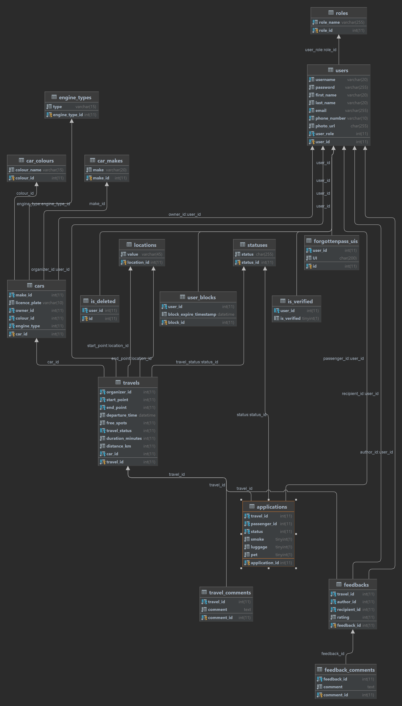

# Carpooling Web Application

## Project Description

Carpooling is a web application designed to facilitate shared travel arrangements. Users can either offer rides by organizing travels or join others by requesting to participate in their trips. The platform emphasizes ease of use, safety, and community engagement, offering both public and private features tailored to enhance the user experience.

## Functional Requirements

### Entities

- **Users** must have a username, password, first name, last name, email, and phone number with specific validation rules for each attribute to ensure data integrity and security.
- **Travels** are defined by starting and ending points, departure time, number of free spots, and an optional comment for additional details like 'no smoking' or 'luggage size restrictions'.
- **Applications** are defined by starting and ending points, also they include the features to mark if you are smoking, having luggage or caring pet with you.

### Public Part

Accessible without authentication, allowing anonymous users to:
- Register and login with email verification.
- View detailed information about the platform's usage, including user count and completed travels.
- See a list of the top 10 travel organizers and passengers.

### Private Part

Requires user authentication to:
- Manage profile details and set a profile photo/avatar.
- Create and browse available travels with sorting, filtering, and pagination.
- Apply for trips, with a system for approval/decline by the driver.
- Provide and view feedback for drivers and passengers.

### Administrative Part

Exclusive to admin users, providing capabilities to:
- Manage user accounts, including blocking/unblocking and searching.
- View, filter, and sort a list of all travels.

### Optional Features

- **Email Verification**: Essential for completing user registration.
- **Easter Eggs**: Creative features like adding cars, a forgotten password verification email, etc.

## REST API

Develop a REST API to offer:
- CRUD operations for users and travels.
- User block/unblock, search functionality.
- Application, approval, and rejection for travels, with filtering and sorting.

### Documentation

Utilize Swagger for comprehensive API documentation, focusing on clear and effective integration instructions.

## External Services

Integrate Microsoft Bing Maps for precise location services and ride duration calculations.

## Technical Requirements

- Adhere to OOP, KISS, SOLID, and DRY principles.
- Maintain a tiered project structure and ensure at least 80% unit test coverage in the service layer.
- Implement BDD for unit tests and proper exception handling.

## Database

Store data in a relational database with a focus on normalization to avoid redundancy and empty fields. Include scripts for database creation and initial data population.

## Additional Features

- **Easter Eggs**: Custom functionalities developed by the team, such as car additions and specialized email services.
- **External CDN**: Use ImgBB for image storage.
- **Email Service**: Utilize MailJet for email communications.

## Getting Started

To set up the project locally, follow these steps:
1. Clone the repository.
2. Run the database creation script to set up the database structure.
3. Populate the database with initial data using the provided script.
4. Follow the instructions for API keys and external services integration.
5. Start the application and navigate through the public and private parts as per your role.

For detailed instructions on API endpoints and usage, refer to the Swagger documentation included in the project.

## Database diagram

